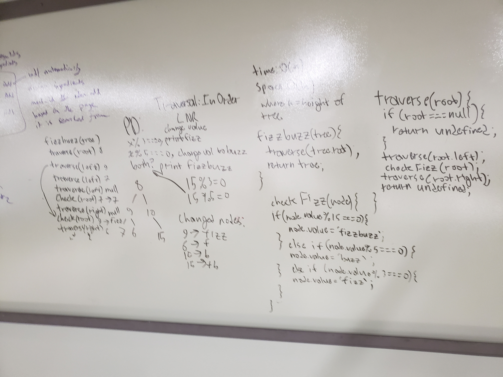

# binary-tree
Code challenge revolving around fizzbuzzing a binary tree.
# PD 
Given a binary tree, replace all numbered nodes with a number divisible by 3 to be 'fizz', divisible by 5 to be 'buzz', and divisible by both to be 'fizzbuzz'. 
Use in order traversal. 
# SOLUTION 
use three functions:
- fizzbuzz(tree)
    - takes in a binary tree, traverses through using traversal() and fizzbuzzes it, and returns it.
- traversal(root)
    - takes in a root and traverses through the binary tree recursively, calling check() on the way.
- check(node)
    - takes in the current node, checks if its value is divisible by 3, 5, or both, and changes the value accordingly.
# WHITEBOARD

